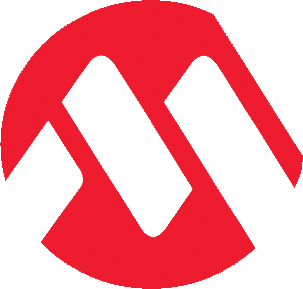
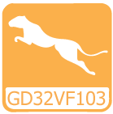
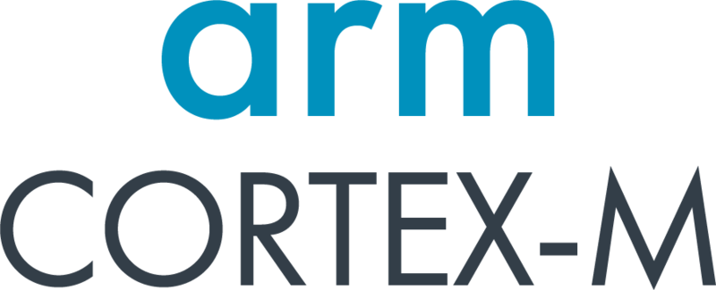
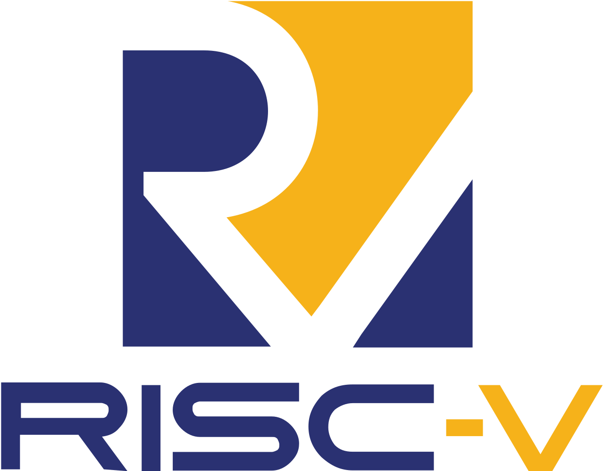
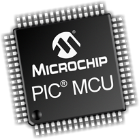
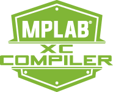
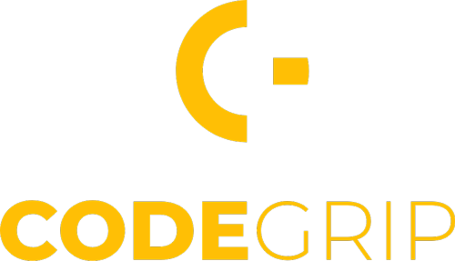
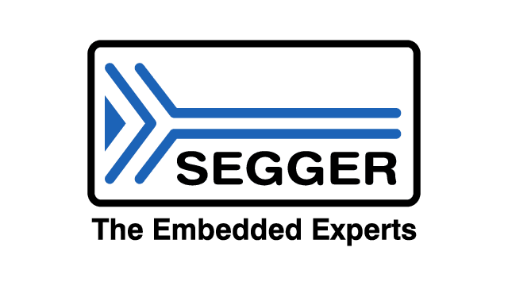
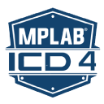
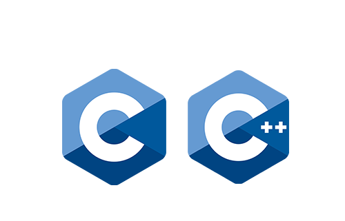

# 👋 Hi, I'm **Ivan Ruzavin**

💡 **Embedded Software Engineer** at [MikroE](https://www.mikroe.com)  
⚙️ Specializing in **SDK design**, **peripheral drivers**, and **microcontroller firmware**  

---

## 🚀 About Me

### I’m an embedded systems engineer with 3 years of professional experience designing unified SDKs and drivers for diverse microcontroller families, including:

  
     
    <b style="display:block; margin:2px 0;">STM32F7x, STM32F4x, STM32L4x, STM32H5x, STM32H7x</b>
    <b style="display:block; margin:2px 0;">STM32F0x, STM32F1x, STM32F3x, STM32L0x, STM32L1x</b>
  

  
     
    <b style="display:block; margin:2px 0;">RA8D2, RA8E1, RA8E2, RA8M1, RA8M2, RA8P1, RA8T1, RA8T2, RA6M5, RA8D1</b>
    <b style="display:block; margin:2px 0;">RA6M3, RA4L1, RA4M1, RA4M3, RA0E2, RA0L1, RA2E3, RA2L2, RA2T1, RA4C1</b>
  

  
     
    <b style="display:block; margin:2px 0;">ATSAM, PIC32MX, PIC32MZ, PIC32C</b>
    <b style="display:block; margin:2px 0;">dsPIC30, PIC24, dsPIC33, PIC18, ATMEGA, AVR</b>
  

  
     
    <b style="display:block; margin:2px 0;">MK5x, MK6x, MK8x, MKVx, MKWx</b>
    <b style="display:block; margin:2px 0;">MK1x, MK2x, MK3x, MK4x</b>
  

  
     
    <b style="display:block; margin:2px 0;">GD32VF103</b>
  

  
     
    <b style="display:block; margin:2px 0;">TMPM3, TMPM4</b>
  

  
     
    <b style="display:block; margin:2px 0;">PSoC 4, FM0, FM3, FM4</b>
  

  
     
    <b style="display:block; margin:2px 0;">M02x, M04x, M05x, M09x, M2x, M4x, MINI, Nano, NUC</b>
  

  
     
    <b style="display:block; margin:2px 0;">TM4C123x, TM4C129x, MSPM0Lx, MSPM0Cx, MSPM0Gx</b>
  

🔹 My expertise covers peripherals like **I2C**, **SPI**, **UART**, **ADC**, **PWM**, **USB**, **Ethernet**, **CAN**, and advanced modules like **VGA** and **HDMI** for personal projects.  
🔹 I'm experienced both to **Bare-Metal** and **Enbedded Linux** programming

**Notable Contributions**
- 💻 [CycloneTCP Ethernet Support](https://github.com/MikroElektronika/mikrosdk_v2/tree/master/thirdparty/ethernet) — seamless embedded networking
- 🚗 Multi-architecture **CAN protocol support**
- ⚡ High-performance **DMA integration** for fast data transfer
- 🔌 [TinyUSB stack support](https://github.com/MikroElektronika/mikrosdk_v2/tree/master/thirdparty/usb) — USB device capabilities across MCUs
- 🏗️ Contributions to [mikroSDK](https://github.com/MikroElektronika/mikrosdk_v2) and [CORE packages](https://github.com/MikroElektronika/core_packages)

---

## 🛠️ My Tech Stack

### Cores / Architectures:

  
     
    <b style="display:block; margin:2px 0;">M0, M1, M23, M3, M33, M4, M7, M85</b>
  

  
     
    <b style="display:block; margin:2px 0;">RISC-V</b>
  

  
     
    <b style="display:block; margin:2px 0;">PIC18, PIC24, dsPIC, PIC32</b>
  

### Compilers:

  
     
    <b style="display:block; margin:2px 0;">GCC for ARM</b>
  

  
     
    <b style="display:block; margin:2px 0;">XC8, XC16, XC32</b>
  

  
     
    <b style="display:block; margin:2px 0;">MikroC Compilers</b>
  

  
     
    <b style="display:block; margin:2px 0;">Clang Compiler</b>
  

  
     
    <b style="display:block; margin:2px 0;">GCC for RISC-V</b>
  

### Programming Tools:

  
     
    <b style="display:block; margin:2px 0;">CODEGRIP</b>
  

  
     
    <b style="display:block; margin:2px 0;">MikroProg</b>
  

  
     
    <b style="display:block; margin:2px 0;">J-Link</b>
  

  
     
    <b style="display:block; margin:2px 0;">MPLab Programmers</b>
  

  
     
    <b style="display:block; margin:2px 0;">Other GDB Programmers</b>
  

### Programming Languages:

  
     
    <b style="display:block; margin:2px 0;">C and C++</b>
  

  
     
    <b style="display:block; margin:2px 0;">Python</b>
  

  
     
    <b style="display:block; margin:2px 0;">J-Link</b>
  

**Specialties:**
- Embedded C & C++
- Low-level hardware interfacing
- Peripheral driver development
- SDK architecture and cross-platform HALs

---

## 📊 Stats

  
  

---

## 🎯 Codewars

  

---

## 📫 Connect With Me

📧 [ivan.ruzavin98@gmail.com](mailto:ivan.ruzavin98@gmail.com)
💼 [LinkedIn](https://www.linkedin.com/in/ivan-ruzavin-825b20251/)

---

## ⚡ Fun Facts

🎵 Professional singer
🥊 Boxing enthusiast
🍺 Beer lover
🌍 Travel addict

  

